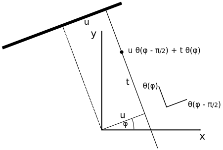

.. _geometry_guide:

##################################
Tomographic acquisition geometries
##################################

This document is intended to introduce definitions and conventions used in ODL `Geometry` classes that represent tomographic acquisition geometries.
The first part introduces the abstract description of data as a function on a data manifold and then shows how this representation is simplified by using a parametrization of the manifold with a tuple of real numbers.
The second part then describes the implementation of these concepts in ODL.

Acquisition geometries are a central part of the ``odl.tomo`` subpackage.
They specify the physical setup of tomographic measurements and thus encode the geometric information that is needed to relate measurement data to the precise configuration of the system that gave rise to this data.
This geometric configuration defines the relation between a (usually unknown) spatial distribution of a physical quantity, e.g., an attenuation coefficient, to measured data, e.g., how many photons were counted per pixel for given source and detector positions in a tomographic scanner.

Geometry and data structure
===========================
Mathematically, the interaction between probing rays and physical matter is often modeled as integration along straight lines.
The corresponding mathematical operation, called **ray transform**, incorporates all geometry information since it is usually defined as a mapping from a space of functions on :math:`\mathbb{R}^d` to a space of functions on a `manifold`_ :math:`M`, the *data manifold*.
This data manifold is typically a subset of the manifold of all lines in :math:`\mathbb{R}^d`, and the value of a function in a certain point on that manifold corresponds to the value of the integral along that line.

For instance, in 2 dimensions and parallel beam geometry, i.e., a setup where all lines from a common direction are parallel, the ray transform can be defined as

    .. math::
        &\mathcal{R} : L^2(\Omega) \to L^2(M),

        &\mathcal{R}(f)(\theta, v) := \int_{\mathbb{R}} f(v + t\theta)\, \mathrm{d}t,\quad \theta \in \Gamma \subset \mathbb{S}^1,\ v \in \theta^\perp,

where :math:`\Omega \subset \mathbb{R}^2` is a bounded domain, :math:`\mathbb{S}^1` is the unit sphere in 2 dimensions and :math:`\theta^\perp = \{x \in \mathbb{R}^2\, |\, \langle x,\, \theta \rangle = 0\}` is the plane (=line) perpendicular to a vector :math:`\theta`.
In this case, the data manifold is

    .. math::
        M = \big\{(\theta, v)\,\big|\, \theta \in \Gamma,\ v \in \theta^\perp \big\}

and encodes the subset of lines in :math:`\mathbb{R}^2` that are parallel to a unit vector in :math:`\Gamma`.

Representation using Euclidean domains
======================================
Function spaces (discretized or continuous) in ODL are, up to a few exceptions, defined on rectangular domains.
Such spaces have a relatively simple structure and can be represented and manipulated very efficiently.
Therefore ODL does not represent data directly as functions on manifolds, but rather as functions on a *coordinate domain* that paremetrizes the manifold.

For instance, in the 2D parallel beam example above, a unit vector :math:`\theta \in \mathbb{S}^1` can be parametrized by an angle :math:`\varphi \in [0, 2\pi)`, and a vector :math:`v` on the line :math:`\theta^\perp` by a single number :math:`s \in \mathbb{R}`.
Such a representation additionally requires a *convention* for a translation between coordinates :math:`(\varphi, s)` and points :math:`(\theta, v)` on the manifold, i.e., a map between the coordinate domain and the data manifold.
Such a map is usually called a *parametrization* or `chart`_ of the manifold.

In our example, we could thus redefine the ray transform as a map between Euclidean function spaces like this:

    .. math::
        & \mathcal{R} :  L^2(\Omega) \to L^2(I \times D),

        & \mathcal{R}(f)(\varphi, u) := \int_{\mathbb{R}} f\big( u\theta(\varphi - \pi/2) + t\theta(\varphi) \big)\, \mathrm{d}t.

Here, :math:`I \subset [0, 2\pi)` and :math:`D \subset \mathbb{R}` are intervals and

    .. math::
        & (\varphi, u) \mapsto \big( \theta(\varphi), u \theta(\varphi - \pi/2)\big),

        & \theta(\varphi) := (-\sin\varphi, \cos\varphi)

is a parametrization of the data manifold.

    Parametrization of lines in 2D parallel beam geometry.

.. _manifold: https://en.wikipedia.org/wiki/Manifold
.. _chart: https://en.wikipedia.org/wiki/Manifold#Charts

Geometries in ODL
=================
The `RayTransform` in ODL is an `Operator` between `DiscreteLp` type discretized function spaces defined on rectangular domains.
The **reconstruction space** ("volume"), i.e., the :term:`domain` of the ray transform, is naturally described as functions on a Euclidean space, and as derived above, the **data space**, i.e., the :term:`range` of the ray transform, can also be defined in terms of Euclidean coordinates.
The missing component, which is the mapping from coordinates to points on the data manifold, is encoded in the `Geometry` class and its subclasses as described in the following.

The `Geometry` class
--------------------
All ODL geometries derive from the abstract `Geometry` class that provides a basic structure.
Most attributes are intended to query for geometric information, e.g., source and detector positions and their orientations.
See the documentation of `Geometry` and `Detector` for details on the API.

Geometric definitions and conventions
-------------------------------------
Since one part of the geometry parameters usually refer to a system motion or transformation, they are called **motion parameters**.
For instance, in a 2D parallel beam geometry, the single motion parameter is the angle of rotation around the origin.
In general, they can refer to any encoding of the motion of the acquisition system.
The *initial state* of the system corresponds to motion parameters :math:`m = 0`.

.. note::
    The above definition of the initial state does not imply that :math:`m = 0` must be in the set of valid parameters -- it merely means that definitions are understood as relative to zero.

To determine the spatial position :math:`p(m, u)` of a detector point at a given configuration, both motion parameter :math:`m` and detector parameter :math:`u` need to be provided.

The vector pointing from the origin to a detector point is decomposed into two components:

- a detector reference point :math:`r = r(m)` only depending on the motion parameter (`Geometry.det_refpoint`),
- an *intrinsic* shift :math:`s = s(u)` within the detector only depending on the detector parameter (`Detector.surface`).

The total displacement is then given by

    .. math::
        p(m, u) = r(m) + R(m) s(u),

where :math:`R(m)` is a transformation of the detector reference system (in which :math:`s(u)` is defined) to the coordinate system at motion parameter :math:`m` (in particular, :math:`R(0) = I`, the identity matrix).

.. note::
    Here and in the following, *intrinsic* transformations (such as shifts or rotations) mean transformations in the local coordinate system, while *extrinsic* transformations are relative to the global ("world") coordinate system.
    The extrinsic counterpart of an intrinsic transformation can be computed as follows:

    Suppose :math:`t: \mathbb{R}^3 \to \mathbb{R}^3` is an intrinsic transformation and :math:`C: \mathbb{R}^3 \to \mathbb{R}^3` the coordinate transform from world to local coordinates.
    Then, the extrinsic variant :math:`T` of :math:`t` is given as :math:`T = C^{-1} \circ t \circ C`, i.e., world-to-local transform, followed by the local transform :math:`t`, followed by the mapping :math:`C^{-1}` back to world coordinates.

    The in-detector shift :math:`s(u)` above is given in local coordinates :math:`u` and should be translated to global coordinates.
    Therefore, only the left part :math:`\tilde T = C^{-1} \circ t` applies in that case.

In the 2d parallel beam example, :math:`r(m)` corresponds to :math:`\theta(\varphi)`.
Since :math:`\theta(0) = (0, 1)` we assume that in its reference state the detector is aligned with the :math:`x` axis, i.e., :math:`s(u) = (u, 0)`.
The detector point at :math:`(\varphi, u)` is now given by

    .. math::
        & p(\varphi, u) = R(\varphi)
        \begin{pmatrix}
            0 \\
            1
        \end{pmatrix}
        + R(\varphi)
        \begin{pmatrix}
            u \\
            0
        \end{pmatrix},

        & R(\varphi) =
        \begin{pmatrix}
            \cos\varphi & -\sin\varphi \\
            \sin\varphi & \cos\varphi
        \end{pmatrix}

The rotation matrix :math:`R(\varphi)` is exposed as `Geometry.rotation_matrix`.

Determining the initial configuration
^^^^^^^^^^^^^^^^^^^^^^^^^^^^^^^^^^^^^
In two dimensions, the default initial configuration of geometries in ODL is

    .. math::
        r(0) = \alpha
        \begin{pmatrix}
            0 \\
            1
        \end{pmatrix},
        \ s(u) = u
        \begin{pmatrix}
            1 \\
            0
        \end{pmatrix}.

If a different initial detector position :math:`r(0) = \alpha (-\sin\psi, \cos\psi)^{\mathrm{T}}` is chosen, the initial detector axis is taken to be :math:`s(1) = (\cos\psi, \sin\psi)` by default.

In three dimensions, there is no unique way to rotate one vector to another, which is why a convention is required in this case.
The standard configuration in 3d is

    .. math::
        r(0) =
        \begin{pmatrix}
            0 \\
            1  \\
            0
        \end{pmatrix},
        \
        s(1, 0) =
        \begin{pmatrix}
            1 \\
            0  \\
            0
        \end{pmatrix},
        \
        s(0, 1) =
        \begin{pmatrix}
            0 \\
            0  \\
            1
        \end{pmatrix}

for initial detector position and axes.
Here the zero parameter in :math:`r(0)` can have one or more components, and if the detector is only one-dimensional, we use :math:`s(0) = (1, 0, 0)^{\mathrm{T}}` only.

.. figure:: figures/coord_sys_3d.svg
    :width: 50%
    :align: center

    Default 3D coordinate system.
    The configuration is chosen such that the detector axes coincide with the standard :math:`x` and :math:`z` coordinate axes.

The transition to other initial states is done by rotating the whole system, and the rotation is either explicitly specified or computed to rotate one vector to another.
Let :math:`v_1, ..., v_K \in \mathbb{R}^3` be the vectors defining the initial configuration of a 3d geometry, and :math:`v_1^{(\text{def})}, ..., v_K^{(\text{def})}` are their default values.
The rotated configuration is given by

    .. math::
        v_k = R^{(\mathrm{i})}\, v_k^{(\text{def})},

i.e., *all vectors are transformed by the same rotation*.
The matrix :math:`R^{(\mathrm{i})} \in \mathbb{R}^{3 \times 3}` is chosen to rotate the first vector from its default :math:`v_1^{(\text{def})}` to its actual value :math:`v_1`, i.e.,

    .. math::
        R^{(\mathrm{i})} v_1^{(\text{def})} = v_1.

Since the rotation :math:`R^{(\mathrm{i})}` is not uniquely determined, we choose to perform a rotation in the plane spanned by :math:`v_1^{(\text{def})}` and :math:`v_1`, making use of `Rodrigues' rotation formula <https://en.wikipedia.org/wiki/Rodrigues%27_rotation_formula>`_:

    .. math::
        a &= \frac{v_1^{(\text{def})} \times v_1}{\big| v_1^{(\text{def})} \times v_1 \big|},\ \cos\beta = \langle v_1^{(\text{def})},\, v_1 \rangle,

        R^{(\mathrm{i})} v &= \cos\beta v + \sin\beta (a \times v) + (1 - \cos\beta)\langle a,\, v \rangle a.

This construction becomes unstable when :math:`v_1^{(\text{def})} \approx v_1`.
Therefore, if :math:`\big\| v_1^{(\text{def})} - v_1 \big\| < \delta` for a threshold :math:`\delta`, we take :math:`v_1 = v_1^{(\text{def})}`.

Below are some concrete examples for how this computation is done in practice.
For a list of implemented geometries, check the API documentation of the ``odl.tomo.geometry`` subpackage.

`Parallel3dEulerGeometry`
^^^^^^^^^^^^^^^^^^^^^^^^^
In this geometry, the motion parameters are two or three Euler angles, and the detector is two-dimensional and flat.
The handle :math:`v_1` for the initial rotation is the initial detector position, provided as ``det_pos_init`` parameter.
Its default value is :math:`v_1^{(\text{def})} = (0, 1, 0)^{\mathrm{T}}`.

`Parallel3dAxisGeometry`
^^^^^^^^^^^^^^^^^^^^^^^^
This geometry, like all subclasses of `AxisOrientedGeometry`, has a fixed symmetry axis, provided as ``axis`` parameter.
Its motion parameter is a single rotation angle around this axis.
The initial orientation handle :math:`v_1` is the symmetry axis, with default value :math:`v_1^{(\text{def})} = (0, 0, 1)^{\mathrm{T}}`.

`ConeFlatGeometry`
^^^^^^^^^^^^^^^^^^
The 3D cone beam geometry with circular acquisition curve is also an `AxisOrientedGeometry`.
Here, the symmetry axis is perpendicular to the source and detector circles (which can be different but lie in the same plane).
Its motion parameter is a single angle that parametrizes the position of the source on the circle, and the detector lies opposite of the source point.
As in `Parallel3dAxisGeometry`, the initial orientation is determined by the symmetry axis, with the same default.

.. figure:: figures/circular_cone3d_sketch.svg
    :width: 75%
    :align: center

Detector properties
-------------------
The detector model in ODL is intended to be very flexible and able to encode many different types of detectors.
Besides the obvious flat 2d detectors, it is also possible to implement curved detectors as used in medical CT, PET detector rings, Compton cameras, point-like transducers etc.

Nevertheless, names and concepts are centered around the surface-like detector model since it is most widely used in practice.
In particular, the function :math:`s(u)` mapping a detector parameter to a point on the detector (e.g. two angles to a point on a curved detector surface) is called ``surface``.

There are two methods that can be implemented for additional functionality, ``surface_deriv`` and ``surface_measure``.
The former should be the derivative map

    .. math::
        & \partial s : D \to TM_{\mathrm{d}},

        & (\partial s)_i = \frac{\partial s}{\partial u_i}

from :math:`D` to the tangent bundle :math:`TM_{\mathrm{d}}` of the detector manifold :math:`M_{\mathrm{d}}`.
This means that for each fixed :math:`u \in D`, the vectors :math:`(\partial s(u))_i` are `tangent vectors <https://en.wikipedia.org/wiki/Tangent_space>`_ at the point :math:`s(u) \in M_{\mathrm{d}}`.
These vectors form a local coordinate system for :math:`M_{\mathrm{d}}` at :math:`s(u)` if the matrix :math:`\partial s(u)` is not rank-deficient.

This derivative can be used to define a surface measure :math:`\mathrm{d}\mu(u)` such that one can integrate over the detector surface with correct weights.
For a one-dimensional detector and a single parameter :math:`u \in \mathbb{R}`, the measure is given by the `length of the tangent vector <https://en.wikipedia.org/wiki/Curve#Length_of_a_curve>`_,

    .. math::
        \mathrm{d}\mu(u) = |s'(u)|\, \mathrm{d}u.

On a two-dimensional detector with two parameters, the weight factor is the length of the `cross product of the two canonical tangent vectors <https://en.wikipedia.org/wiki/Surface_area>`_,

    .. math::
        \mathrm{d}\mu(u) = \big| (\partial s(u))_1 \times (\partial s(u))_2 \big|\, \mathrm{d}u.

Thus, in these two cases, a default implementation for ``surface_measure`` is provided as above.
Subclasses that do not fall into these categories should override ``surface_measure``.
