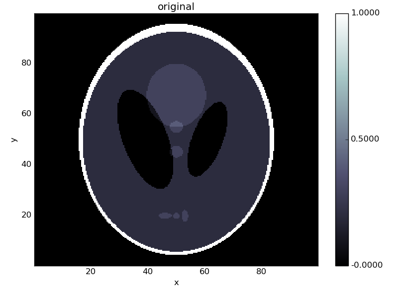
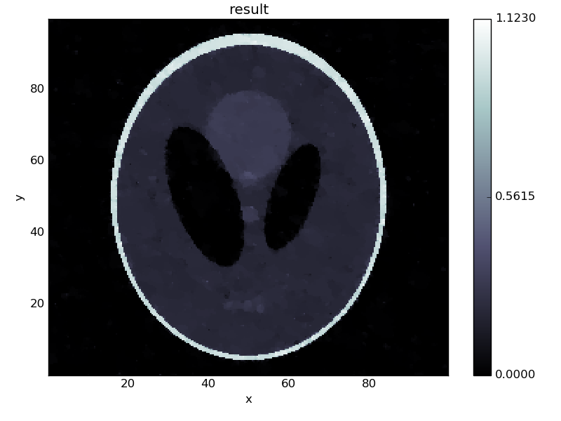

.. _chambolle_pock_in_depth:

#####################
Chambolle-Pock solver
#####################

The `chambolle_pock_solver`, was introduced in 2011 by Chambolle and Pock in the paper `A first-order primal-dual algorithm for convex problems with applications to imaging
<https://hal.archives-ouvertes.fr/hal-00490826/document>`_.
It is a method for solving convex, yet non smooth problems of the form

.. math::
   
   min_{x \in X} F(K x) + G(x)

where :math:`K` is a linear `Operator` :math:`K : X -> Y` where :math:`X` and :math:`Y` are `LinearSpace`'s and :math:`G : X \mapsto [0, +\infty]` and :math:`F : Y \mapsto [0, +\infty]` are proper, convex, lower-semicontinuous functionals. For more information on the mathematics, please see :ref:`chambolle_pock`.

Using the Chambolle-Pock solver
===============================

There are several examples in the examples folder of ODL, these include denoising, deblurring and tomography. There is also an example of using a diagonal pre-conditioner.

We will walk through the solution of a typical problem using the Chambolle-Pock solver. The problem we'll be looking at is the TV regularized denoising problem with a l2 data discrepancy term.

.. math::

   f(x) = \frac{1}{2} ||x - g||_2^2 + \lambda || |\nabla x| ||_1

With a positivity condition, enforced by

.. math::

   G(x) = {0 \text{ if } x \geq 0, \infty \text{ if } x < 0} ,

Here, :math:`g` denotes the image to denoise, :math:`||.||_2` the l2-norm, :math:`||.||_1` the l1-semi-norm, :math:`\nabla`  the spatial gradient, :math:`\lambda` the regularization
parameter, :math:`|.|` the point-wise magnitude across the vector components of :math:`\nabla x`.

To fit this into the Chambolle-Pock framework, we need to write :math:`f(x)` on the form :math:`F(Kx)` where :math:`F` is a convex functional and :math:`K` is a linear operator. The standard way of doing this is to let :math:`K` be a vector of operators :math:`K = (I, \nabla)` with identity mapping :math:`I`. Thus

.. math::

   K(x) = [x, \nabla(x)]

With this choice, we can let 

.. math::
 
   F(\vec{x}) = F([x_1, x_2]) = ||x_1 - g||_2^2 + \lambda || \ | x_2 | \ ||_1

To implement this in ODL, we first need to decide on what spaces to solve the problem in. In this case, we want a L2 space on the square :math:`[0, 100] \times [0, 100]`. We chose 256 discretization points per axis:

.. code-block:: python

   space = odl.uniform_discr([0, 0], [100, 100], [256, 256])

We also need to generate some test data since this is part of the objective functional. We pick the modified Shepp-Logan phantom with 10% additive Gaussian noise.

.. code-block:: python

   orig = odl.util.shepp_logan(space, modified=True)
   noisy = orig + odl.util.white_noise(space) * 0.1

We now need to define the forward operator :math:`K`. We begin by its constituents:

.. code-block:: python

   I = odl.IdentityOperator(space)
   gradient = odl.Gradient(space, method='forward')

where we chose the 'forward' method for the gradient for numerical stability reasons. To create :math:`K`, we note that :math:`K` is a special case of a `BroadcastOperator`, an operator that broadcasts its argument to several sub-operators. Hence we may create :math:`K` by

.. code-block:: python

   K = odl.BroadcastOperator(I, gradient)

We can now proceed to the problem specification. The Chambolle-Pock solver does not take the functionals themselves as arguments, instead it needs the proximal operators associated with them. ODL implements most common functionals such as L1, L2 and Kulback-Leibler distance. If you are interested in writing original proximal operators, see :ref:`proximal_operators` for a mathematical discussion.

In this case, we first create the l2 and l1 discreptancy terms

.. code-block:: python
   
   prox_convconj_l2 = odl.solvers.proximal_convexconjugate_l2(space, g=noisy)
   prox_convconj_l1 = odl.solvers.proximal_convexconjugate_l1(gradient.range, lam=1/30.0)

Note that :math:`\lambda` is actually part of the proximal operator. Finally, we need to combine these, similarly to how we combined operators to form :math:`K`

.. code-block:: python

   proximal_F = odl.solvers.combine_proximals([prox_convconj_l2,
                                               prox_convconj_l1])

We also select the proximal operator corresponding the positivity constraint

.. code-block:: python

   proximal_G = odl.solvers.proximal_nonnegativity(space)

Now that the problem is set up, we need to select some solver parameters. For Chambolle-Pock, there is one main rule that we can use: The product of the primal step :math:`\tau`, the dual step :math:`\sigma` and the squared operator norm :math:`||K||^2` has to be smaller than 1: :math:`\tau \sigma ||K||^2 < 1`. Except for this selecting :math:`\tau` and :math:`\sigma` is down to trial and error. Here we pick them equal:

.. code-block:: python
   
   op_norm = odl.power_method_opnorm(K, 5, xstart=noisy)
   tau = sigma = 1.0 / op_norm

Finally, we pick a starting point and run the algorithm:

.. code-block:: python

   x = K.domain.zero()   

   odl.solvers.chambolle_pock_solver(
       K, x, tau=tau, sigma=sigma, proximal_primal=proximal_G,
       proximal_dual=proximal_F, niter=100)

   orig.show('original')
   noisy.show('noisy')
   x.show('result')

Yielding the following figures:

.. image:: figures/chambolle_pock_noisy.png

