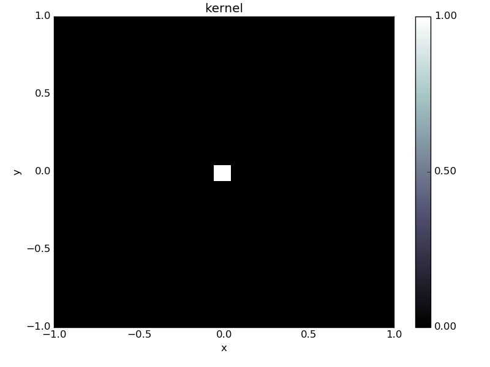
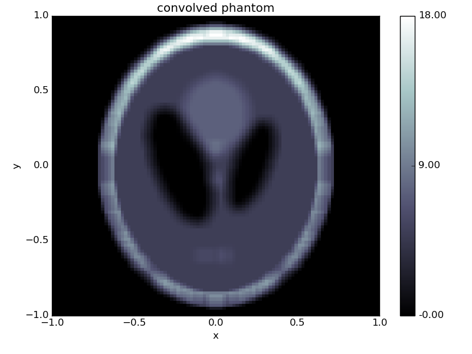

###############
Getting started
###############

Welcome to the ODL users guide, this guide is intended to give you a simple introduction to
ODL and how to work with it. If you need help on a specific function you should look at its
documentation.

The best way to get started with ODL as a user is generally to find one (or more) examples
that are relevant to whatver problem you are studying. These are available in the `examples folder on GitHub <https://github.com/odlgroup/odl/tree/master/examples>`_. They are mostly written to be copy-paste friendly
and show how to use the respective operators, solvers and spaces in a correct manner.

Example: Solving an inverse problem
===================================
In what follows, we will give an example of the workflow one might have when solving an inverse problem as
it is encountered "in real life". The problem we want to solve is

.. math::
   
   Af = g

Where :math:`A` is the `convolution <https://en.wikipedia.org/wiki/Convolution>`_ operator

.. math::
   
   (Af)(x) = \int f(x) k(x-y) dy

where :math:`k` is the convolution kernel, :math:`f` is the solution and :math:`g` is known data. As is typical in applications, the convolution operator may not be available in ODL (we'll pretend it's not), so we will need to implement it.

We start by finding a nice implementation of the convolution operator, `scipy happens to have one <http://docs.scipy.org/doc/scipy/reference/generated/scipy.signal.fftconvolve.html>`_, and create a wrapping `Operator` for it in ODL.

.. code-block:: python

   import odl
   import scipy
   
   class Convolution(odl.Operator):
       """Operator calculating the convolution of a kernel with a vector.
   
       The operator inherits from ``odl.Operator`` to be able to be used with odl.
       """
   
       def __init__(self, kernel):
           """Initialize a convolution operator with a known kernel."""
   
           # Store the kernel
           self.kernel = kernel
           
           # Initialize the Operator class by calling its __init__ method.
           # This sets properties such as domain and range and allows the other
           # operator convenience functions to work.
           odl.Operator.__init__(self, domain=kernel.space, range=kernel.space,
                                 linear=True)
   
       def _call(self, x):
           """Implement calling the operator by calling scipy."""
           return scipy.signal.convolve(self.kernel, x, mode='same')
   
We can verify that our operator works by calling it on some data. This can either come from some outside source, or from simulations. ODL also provides a nice range of standard phantoms such as the `cuboid` and `shepp_logan` phantoms:

.. code-block:: python

   space = odl.uniform_discr([-1, -1], [1, 1], [100, 100])
   kernel = odl.phantom.cuboid(space, [-0.05, -0.05], [0.05, 0.05])
   conv = Convolution(kernel)
   phantom = odl.phantom.shepp_logan(space, modified=True)
   data = conv(phantom)
   
   kernel.show('kernel')
   phantom.show('phantom')
   data.show('convolved phantom')

We can use this data to try to solve the inverse problem. To solve that, we need further properties of the operator. Specifically, we need an `Operator.adjoint`. Luckily, the convolution operator is self adjoint if the kernel is symmetric, so we can add: 

.. code-block:: python

   class Convolution(odl.Operator):
       ...  # old code

       @property  # making the adjoint a property lets users access it as conv.adjoint
       def adjoint(self):
           return self  # the adjoint is the same as the operator
   
Now lets try with the simple `landweber` solver:

.. code-block:: python

   # Need operator norm for step length (omega)
   opnorm = odl.power_method_opnorm(conv, niter=10)
   
   x = space.zero()
   odl.solvers.landweber(conv, x, data, niter=100, omega=1/opnorm**2)
   x.show('landweber solution')
   

This solution is not very good, mostly due to the ill-posedness of the convolution operator. 
Other solvers, like the `conjugate_gradient` solver give similar results:

.. code-block:: python

   x = space.zero()
   odl.solvers.conjugate_gradient(conv, x, data, niter=100)
   x.show('conjugate gradient solution')

A method to remedy this problem is to instead consider a regularized problem. One of the classic regularizers is `Tikhonov regularization <https://en.wikipedia.org/wiki/Tikhonov_regularization>`_ where we instead study the problem

.. math::
   
   \min_f ||Af - g||_2 + ||Bf||_2

Where :math:`B` is a regularizer. To solve this with the above solvers, we can find the first order optimality conditions

.. math::
 
   2 A^* (Af - g) + 2 B^* B f =0

Where :math:`A^*` is the adjoint of :math:`A`. This can be rewritten on the form :math:`Ax=b`:

.. math::

   (A^* A + B^* B) f = A^* g

We can try solving this with :math:`B` as the `IdentityOperator` using ODL:

.. code-block:: python

   I = odl.IdentityOperator(space)
   reg_op = conv.adjoint * conv + 0.1 * I.adjoint * I
   rhs = conv.adjoint(data)
   
   x = space.zero()
   odl.solvers.conjugate_gradient(reg_op, x, rhs, niter=100)
   x.show('Tikhonov identity conjugate gradient solution')

.. image:: figures/getting_started_tikhonov_identity_conjugate_gradient.png

Slightly better, but no major upgrade. What about letting :math:`B` be the `Gradient`?

.. code-block:: python

   grad = odl.Gradient(space)
   reg_op = conv.adjoint * conv + 0.0001 * grad.adjoint * grad
   rhs = conv.adjoint(data)
   
   x = space.zero()
   odl.solvers.conjugate_gradient(reg_op, x, rhs, niter=100)
   x.show('Tikhonov gradient conjugate gradient solution')

Perhaps a bit better, but far from excellent. Lets try more modern methods, like TV regularization. Here we want to solve the problem

.. math::

   \min_{0 \leq f \leq 1} ||Af - g||_2 + ||\nabla f||_1

Since this is a non-differentiable problem we need more advanced solvers to solve this problem. One of the stronger solvers in ODL is the Douglas-Rachford Primal-Dual solver (`douglas_rachford_pd`) which uses :ref:`proximal_operators` to solve the optimization problem. Several examples of this and similar solvers (`forward_backward_pd`, `chambolle_pock_solver`, etc) are available in the ODL examples folder.

.. code-block:: python

   # Assemble all operators
   grad = odl.Gradient(space)
   lin_ops = [conv, grad]
   
   # Create proximals as needed
   prox_cc_g = [odl.solvers.proximal_cconj_l2(space, g=data),
                odl.solvers.proximal_cconj_l1(grad.range, lam=0.001)]
   prox_f = odl.solvers.proximal_box_constraint(space, 0, 1)
   
   # Find scaling constants
   opnorm_conv = odl.power_method_opnorm(conv, niter=10, xstart=data)
   opnorm_grad = odl.power_method_opnorm(grad, niter=10, xstart=data)
   sigma = [1 / opnorm_conv**2, 1 / opnorm_grad**2]
   
   # Solve
   x = space.zero()
   odl.solvers.douglas_rachford_pd(x, prox_f, prox_cc_g, lin_ops,
                                   tau=1.0, sigma=sigma, niter=100)
   x.show('TV douglas rachford solution')

.. image:: figures/getting_started_TV_douglas_rachford.png

This solution is almost perfect, and we can happily go on to solving more advanced problems!

Full code in this example available below

.. code-block:: python

   import odl
   import scipy
   
   
   class Convolution(odl.Operator):
       """Operator calculating the convolution of a kernel with a vector.
   
       The operator inherits from ``odl.Operator`` to be able to be used with odl.
       """
   
       def __init__(self, kernel):
           """Initialize a convolution operator with a known kernel."""
   
           # Store the kernel
           self.kernel = kernel
           odl.Operator.__init__(self, domain=kernel.space, range=kernel.space,
                                 linear=True)
   
       def _call(self, x):
           return scipy.signal.fftconvolve(self.kernel, x, mode='same')
   
       @property
       def adjoint(self):
           return self
   
   space = odl.uniform_discr([-1, -1], [1, 1], [100, 100])
   kernel = odl.phantom.cuboid(space, [-0.05, -0.05], [0.05, 0.05])
   conv = Convolution(kernel)
   phantom = odl.phantom.shepp_logan(space, modified=True)
   data = conv(phantom)
   
   kernel.show('kernel')
   phantom.show('phantom')
   data.show('convolved phantom')
   
   # Landweber
   
   # Need operator norm for step length (omega)
   opnorm = odl.power_method_opnorm(conv, niter=10)
   
   x = space.zero()
   odl.solvers.landweber(conv, x, data, niter=100, omega=1/opnorm**2)
   x.show('landweber solution')
   
   # Conjugate gradient
   
   x = space.zero()
   odl.solvers.conjugate_gradient(conv, x, data, niter=100)
   x.show('conjugate gradient solution')
   
   # Tikhonov with identity
   
   I = odl.IdentityOperator(space)
   reg_op = conv.adjoint * conv + 0.1 * I.adjoint * I
   rhs = conv.adjoint(data)
   
   x = space.zero()
   odl.solvers.conjugate_gradient(reg_op, x, rhs, niter=100)
   x.show('Tikhonov identity conjugate gradient solution')
   
   # Tikhonov with gradient
   
   grad = odl.Gradient(space)
   reg_op = conv.adjoint * conv + 0.0001 * grad.adjoint * grad
   rhs = conv.adjoint(data)
   
   x = space.zero()
   odl.solvers.conjugate_gradient(reg_op, x, rhs, niter=100)
   x.show('Tikhonov gradient conjugate gradient solution')
   
   # douglas rachford
   
   # Assemble all operators
   grad = odl.Gradient(space)
   lin_ops = [conv, grad]
   
   # Create proximals as needed
   prox_cc_g = [odl.solvers.proximal_cconj_l2(space, g=data),
                odl.solvers.proximal_cconj_l1(grad.range, lam=0.001)]
   prox_f = odl.solvers.proximal_box_constraint(space, 0, 1)
   
   # Find scaling constants
   opnorm_conv = odl.power_method_opnorm(conv, niter=10, xstart=data)
   opnorm_grad = odl.power_method_opnorm(grad, niter=10, xstart=data)
   sigma = [1 / opnorm_conv**2, 1 / opnorm_grad**2]
   
   # Solve
   x = space.zero()
   odl.solvers.douglas_rachford_pd(x, prox_f, prox_cc_g, lin_ops,
                                   tau=1.0, sigma=sigma, niter=100)
   x.show('TV Douglas-Rachford solution')
   