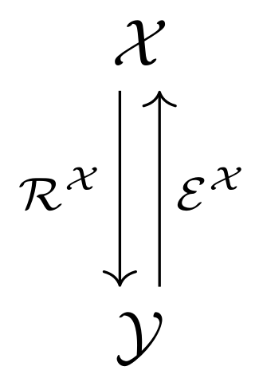

.. _discretizations:

###############
Discretizations
###############

Mathematical background
=======================

In mathematics, the term :term:`discretization` stands for the transition from abstract, continuous,
often infinite-dimensional objects to concrete, discrete, finite-dimensional counterparts. We define
discretizations as tuples encompassing all necessary aspects involved in this transition. Let
:math:`\mathcal{X}` be an arbitrary set, :math:`\mathbb{F}^n` be the set of :math:`n`-tuples where
each component lies in :math:`\mathbb{F}`. We define two mappings

.. math::
    \mathcal{R}_\mathcal{X}: \mathcal{X} \to \mathbb{F}^n,

    \mathcal{E}_\mathcal{X}: \mathbb{F}^n \to \mathcal{X},

which we call :term:`sampling` and :term:`interpolation`, respectively. Then, the discretization of
:math:`\mathcal{X}` with respect to :math:`\mathbb{F}^n` and the above operators is defined as the
tuple

.. math::
    \mathcal{D}(\mathcal{X}) = (\mathcal{X}, \mathbb{F}^n,
    \mathcal{R}_\mathcal{X}, \mathcal{E}_\mathcal{X}).

The following abstract diagram visualizes a discretization:

TODO: write up in more detail

Example
=======

Let :math:`\mathcal{X} = C([0, 1])` be the space of real-valued
continuous functions on the interval :math:`[0, 1]`, and let :math:`x_1 < \dots < x_n`
be ordered sampling points in :math:`[0, 1]`.

**Restriction operator:**

We define the *grid collocation operator* as

.. math::
    \mathcal{C}: \mathcal{X} \to \mathbb{R}^n,

    \mathcal{C}(f) := \big(f(x_1), \dots, f(x_n)\big).

The abstract object in this case is the input function :math:`f`, and
the operator evaluates this function at the given points, resulting in
a vector in :math:`\mathbb{R}^n`.

This operator is implemented as `PointCollocation`.

**Extension operator:**

Let discrete values :math:`\bar f \in \mathbb{R}^n` be given. Consider the linear interpolation
of those values at a point :math:`x \in [0, 1]`:

.. math::
    I(\bar f; x) := (1 - \lambda(x)) f_i + \lambda(x) f_{i+1},

    \lambda(x) = \frac{x - x_i}{x_{i+1} - x_i},

where :math:`i` is the index such that :math:`x \in [x_i, x_{i+1})`.

Then we can define the linear interpolation operator as

.. math::
    \mathcal{L} : \mathbb{R}^n \to C([0, 1]),

    \mathcal{L}(\bar f) := I(\bar f; \cdot),

where :math:`I(\bar f; \cdot)` stands for the function
:math:`x \mapsto I(\bar f; x)`.

Hence, this operator maps the finite array :math:`\bar f \in \mathbb{R}^n`
to the abstract interpolating function :math:`I(\bar f; \cdot)`.

This interpolation scheme is implemented in the `LinearInterpolation` operator.

Useful Wikipedia articles
=========================

- Discretization_

.. _Discretization: https://en.wikipedia.org/wiki/Discretization
