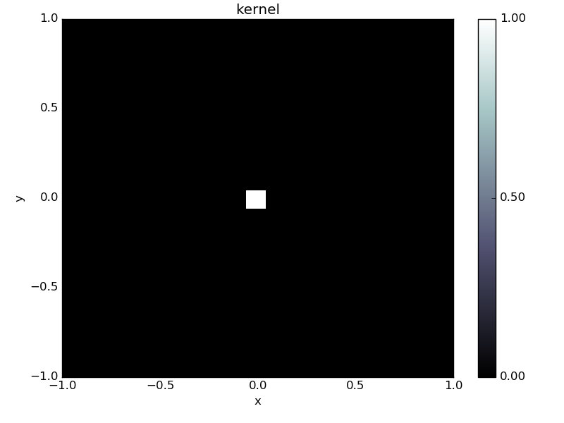

.. _first_steps:

##################
First steps
##################

This guide is intended to give you a simple introduction to ODL and how to work with it.
If you need help with a specific function you should look at the `ODL API reference <https://odlgroup.github.io/odl/odl.html>`_.

The best way to get started with ODL as a user is generally to find one (or more) examples that are relevant to whichever problem you are studying.
These are available in the `examples folder on GitHub <https://github.com/odlgroup/odl/tree/master/examples>`_.
They are mostly written to be copy-paste friendly and show how to use the respective operators, solvers and spaces in a correct manner.

Example: Solving an inverse problem
===================================
In what follows, we will give an example of the workflow one might have when solving an inverse problem as it is encountered "in real life".
The problem we want to solve is

.. math::

   Af = g

Where :math:`A` is the `convolution <https://en.wikipedia.org/wiki/Convolution>`_ operator

.. math::

   (Af)(x) = \int f(x) k(x-y) dy

where :math:`k` is the convolution kernel, :math:`f` is the unknown solution and :math:`g` is known data.
As is typical in applications, the convolution operator may not be available in ODL (we'll pretend it's not),
so we will need to implement it.

We start by finding a nice implementation of the convolution operator --
`SciPy happens to have one <http://docs.scipy.org/doc/scipy/reference/generated/scipy.signal.fftconvolve.html>`_ --
and create a wrapping `Operator` for it in ODL.

.. code-block:: python

   import odl
   import scipy.signal

   class Convolution(odl.Operator):
       """Operator calculating the convolution of a kernel with a function.

       The operator inherits from ``odl.Operator`` to be able to be used with ODL.
       """

       def __init__(self, kernel):
           """Initialize a convolution operator with a known kernel."""

           # Store the kernel
           self.kernel = kernel

           # Initialize the Operator class by calling its __init__ method.
           # This sets properties such as domain and range and allows the other
           # operator convenience functions to work.
           super(Convolution, self).__init__(
               domain=kernel.space, range=kernel.space, linear=True)

       def _call(self, x):
           """Implement calling the operator by calling scipy."""
           return scipy.signal.fftconvolve(self.kernel, x, mode='same')

We can verify that our operator works by calling it on some data.
This can either come from an outside source, or from simulations.
ODL also provides a nice range of standard phantoms such as the `cuboid` and `shepp_logan` phantoms:

.. code-block:: python

   # Define the space the problem should be solved on.
   # Here the square [-1, 1] x [-1, 1] discretized on a 100x100 grid.
   space = odl.uniform_discr([-1, -1], [1, 1], [100, 100])

   # Convolution kernel, a small centered rectangle.
   kernel = odl.phantom.cuboid(space, [-0.05, -0.05], [0.05, 0.05])

   # Create convolution operator
   A = Convolution(kernel)

   # Create phantom (the "unknown" solution)
   phantom = odl.phantom.shepp_logan(space, modified=True)

   # Apply convolution to phantom to create data
   g = A(phantom)

   # Display the results using the show method
   kernel.show('kernel')
   phantom.show('phantom')
   g.show('convolved phantom')

.. image:: figures/getting_started_phantom.png

.. image:: figures/getting_started_convolved.png

We can use this as right-hand side in our inverse problem.
We try one of the most simple solvers, the `landweber` solver.
The Landweber solver is an iterative solver that solves

.. math::

   f_{i+1} = f_i - \omega A^* (A(f_i) - g)

where :math:`\omega < 2/\|A\|` is a constant and :math:`A^*` is the `adjoint <https://en.wikipedia.org/wiki/Hermitian_adjoint>`_ operator associated with :math:`A`.
The adjoint is a generalization of the transpose of a matrix and defined as the (unique) operator such that

.. math::
    \langle Ax, y \rangle = \langle x, A^*y \rangle

where :math:`\langle x, y \rangle` is the inner product.
It is implemented in odl as `~odl.operator.operator.Operator.adjoint`.
Luckily, the convolution operator is self adjoint if the kernel is symmetric, so we can add:

.. code-block:: python

   class Convolution(odl.Operator):
       ...  # old code

       @property  # making the adjoint a property lets users access it as conv.adjoint
       def adjoint(self):
           return self  # the adjoint is the same as this operator

With this addition we are ready to try solving the inverse problem using the `landweber` solver:

.. code-block:: python

   # Need operator norm for step length (omega)
   opnorm = odl.power_method_opnorm(A)

   f = space.zero()
   odl.solvers.landweber(A, f, g, niter=100, omega=1/opnorm**2)
   f.show('landweber')

.. image:: figures/getting_started_landweber.png

This solution is not very good, mostly due to the ill-posedness of the convolution operator.
Other solvers like `conjugate gradient on the normal equations <https://en.wikipedia.org/wiki/Conjugate_gradient_method#Conjugate_gradient_on_the_normal_equations>`_ (`conjugate_gradient_normal`) give similar results:

.. code-block:: python

   f = space.zero()
   odl.solvers.conjugate_gradient_normal(A, f, g, niter=100)
   f.show('conjugate gradient')

.. image:: figures/getting_started_conjugate_gradient.png

A method to remedy this problem is to instead consider a regularized problem.
One of the classic regularizers is `Tikhonov regularization <https://en.wikipedia.org/wiki/Tikhonov_regularization>`_ where we add regularization to the problem formulation,
i.e. slightly change the problem such that the obtained solutions have better regularity properties.
We instead study the problem

.. math::

   \min_f \|Af - g\|_2^2 + a \|Bf\|_2^2,

where :math:`B` is a "roughening' operator and :math:`a` is a regularization parameter that determines how strong the regularization should be.
Basically one wants that :math:`Bf` is less smooth than :math:`f` so that the optimum solution is more smooth.
To solve it with the above solvers, we can find the first order optimality conditions

.. math::

   2 A^* (Af - g) + 2 a B^* B f =0

This can be rewritten on the form :math:`Tf=b`:

.. math::

   \underbrace{(A^* A + a B^* B)}_T f = \underbrace{A^* g}_b

We first use a multiple of the `IdentityOperator` in ODL as :math:`B`,
which is also known as 'classical' Tikhonov regularization.
Note that since the operator :math:`T` above is self-adjoint we can use the classical `conjugate_gradient` method instead of `conjugate_gradient_normal`.
This improves both computation time and numerical stability.

.. code-block:: python

   B = odl.IdentityOperator(space)
   a = 0.1
   T = A.adjoint * A + a * B.adjoint * B
   b = A.adjoint(g)

   f = space.zero()
   odl.solvers.conjugate_gradient(T, f, b, niter=100)
   f.show('Tikhonov identity conjugate gradient')

.. image:: figures/getting_started_tikhonov_identity_conjugate_gradient.png

Slightly better, but no major improvement.
What about letting :math:`B` be the `Gradient`?

.. code-block:: python

   B = odl.Gradient(space)
   a = 0.0001
   T = A.adjoint * A + a * B.adjoint * B
   b = A.adjoint(g)

   f = space.zero()
   odl.solvers.conjugate_gradient(T, f, b, niter=100)
   f.show('Tikhonov gradient conjugate gradient')

.. image:: figures/getting_started_tikhonov_gradient_conjugate_gradient.png

Perhaps a bit better, but far from excellent.

Let's try more modern methods, like `TV regularization <https://en.wikipedia.org/wiki/Total_variation_denoising>`_.
Here we want to solve the problem

.. math::
   \min_{0 \leq f \leq 1} \|Af - g\|_2^2 + a \|\nabla f\|_1

Since this is a non-differentiable problem we need more advanced solvers to solve it.
One of the stronger solvers in ODL is the Douglas-Rachford Primal-Dual method (`douglas_rachford_pd`) which uses :ref:`proximal_operators` to solve the optimization problem.
However, as a new user you do not need to consider the specifics, instead you only need to assemble the functionals involved in the problem you wish to solve.

Consulting the `douglas_rachford_pd` documentation we see that it solves problems of the form

.. math::
    \min_x f(x) + \sum_{i=1}^n g_i(L_i x),

where :math:`f`, :math:`g_i` are convex functions, :math:`L_i` are linear `Operator`'s.
By identification, we see that the above problem can be written in this form if we let :math:`f` be the indicator function on :math:`[0, 1]`,
:math:`g_1` be the squared l2 distance :math:`\| \cdot - g\|_2^2`,
:math:`g_2` be the norm :math:`\| \cdot \|_1`,
:math:`L_1` be the convolution operator and :math:`L_2` be the gradient operator.

There are several examples available using this solver as well as similar optimization methods,
e.g. `forward_backward_pd`, `pdhg`, etc in the ODL `examples/solvers <https://github.com/odlgroup/odl/tree/master/examples/solvers>`_ folder.

.. code-block:: python

    # Assemble all operators into a list.
    grad = odl.Gradient(space)
    lin_ops = [A, grad]
    a = 0.001

    # Create functionals for the l2 distance and l1 norm.
    g_funcs = [odl.solvers.L2NormSquared(space).translated(g),
               a * odl.solvers.L1Norm(grad.range)]

    # Functional of the bound constraint 0 <= x <= 1
    f = odl.solvers.IndicatorBox(space, 0, 1)

    # Find scaling constants so that the solver converges.
    # See the douglas_rachford_pd documentation for more information.
    opnorm_A = odl.power_method_opnorm(A, xstart=g)
    opnorm_grad = odl.power_method_opnorm(grad, xstart=g)
    sigma = [1 / opnorm_A ** 2, 1 / opnorm_grad ** 2]
    tau = 1.0

    # Solve using the Douglas-Rachford Primal-Dual method
    x = space.zero()
    odl.solvers.douglas_rachford_pd(x, f, g_funcs, lin_ops,
                                    tau=tau, sigma=sigma, niter=100)
    x.show('TV Douglas-Rachford', force_show=True)

.. image:: figures/getting_started_TV_douglas_rachford.png

This solution is almost perfect, and we can happily go on to solving more advanced problems!

The full code in this example is available below.

.. literalinclude:: code/getting_started_convolution.py
   :language: python
