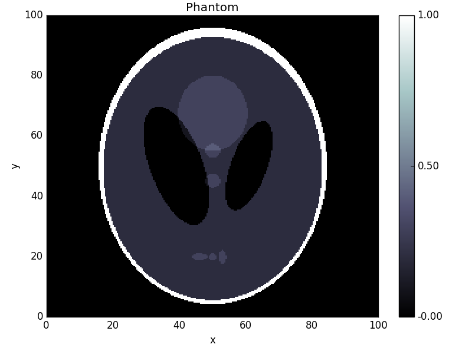

.. _pdhg_guide:

#####################################
Primal-Dual Hybrid Gradient algorithm
#####################################

The Primal-Dual Hybrid Gradient (PDHG) algorithm was studied in 2011 by Chambolle and Pock in the paper `A first-order primal-dual algorithm for convex problems with applications to imaging
<https://hal.archives-ouvertes.fr/hal-00490826/document>`_.
It is a method for solving convex non-smooth problems of the form

.. math::

   \min_{x \in X} f(x) + g(Lx),

where :math:`L` is a linear `Operator` :math:`L : X -> Y`, :math:`X` and :math:`Y` are (discretized) function spaces and :math:`f : X \to [0, +\infty]` and :math:`g : Y \to [0, +\infty]` are proper, convex, lower semi-continuous functionals.
For more information on the mathematics, please see :ref:`the mathematical background article on this method <pdhg_math>`.

Using PDHG
==========

There are several examples in `the examples folder of ODL <https://github.com/odlgroup/odl/tree/master/examples>`_, including denoising, deblurring and tomography.
Here, we will walk through the solution of a typical problem using the PDHG solver.

Mathematical problem setup
--------------------------
The problem we'll be looking at is the TV regularized denoising problem

.. math::
    \min_{x \in X} \left[ d(x) + r(x) + \iota_{[0, \infty]}(x) \right]

with :math:`L^2` data discrepancy term for given data :math:`y \in X`,

.. math::
    d(x) = \frac{1}{2} \|x - y\|_2^2,

TV regularization term

.. math::
    r(x) = \lambda \|\nabla x\|_1

and positivity constraint enforced by the indicator function

.. math::

   \iota_{[0, \infty]}(x) =
   \begin{cases}
     0,         & \text{ if } x \geq 0 \text{ everywhere}, \\
     \infty,    & \text{ else }.
   \end{cases}

Here, :math:`\|\cdot\|_q` is the :math:`L^q` norm (:math:`q = 1,2`), :math:`\nabla` the spatial gradient, and :math:`\lambda` a regularization parameter.

The standard way of fitting this problem into the PDHG framework is to summarize both data fit and regularization terms into the composition part :math:`g \circ L` of the solver, and to set :math:`f` to the positivity constraint :math:`\iota_{[0, \infty]}`.
By setting :math:`L = (I, \nabla): X \to X \times X^d`, where :math:`I` is the identity mapping on :math:`X`, we can write

.. math::
    d(x) + r(x)
    = \left \|
    \begin{pmatrix}
      d(x) \\
      p(x)
    \end{pmatrix}
    \right \|_1
    = \left \|
    \begin{pmatrix}
      \|x - y\|_2^2 / 2 \\
      \lambda \|\nabla x\|_1
    \end{pmatrix}
    \right \|_1
    = \big[ g \circ L \big](x)

with the functional :math:`g: X \times X^d \to \mathbb{R}` defined by

.. math::
    g(x, u) = \left \|
    \begin{pmatrix}
      \|x - y\|_2^2 / 2 \\
      \lambda \|u\|_1
    \end{pmatrix}
    \right \|_1
    = \frac{1}{2} \|x - y\|_2^2 + \lambda \|u\|_1.

Note that the arguments :math:`x, u` of :math:`g` are independent, i.e. the sum of the two functionals is a `SeparableSum`.

.. note::
    The operator :math:`L` maps :math:`X` to the `ProductSpace` :math:`X \times X^d`.
    Such a "one-to-many" type of mapping is also called `BroadcastOperator`.

Numerical solution using ODL
----------------------------

Now we implement a numerical solution to the above defined problem using PDHG in ODL.

Problem setup
^^^^^^^^^^^^^
The first step in the problem setup is the definition of the spaces in which we want to solve the problem.
In this case, we use an :math:`L^2` space on the square :math:`[0, 100] \times [0, 100]`.
We choose 256 discretization points per axis:

.. code-block:: python

    >>> space = odl.uniform_discr(min_pt=[0, 0], max_pt=[100, 100], shape=[256, 256])

In real problems, the data :math:`y` would be given by some measurement, but for the purpose of testing the solver, we generate data by creating a modified `Shepp-Logan phantom <https://en.wikipedia.org/wiki/Shepp%E2%80%93Logan_phantom>`_ and adding 10% Gaussian noise:

.. code-block:: python

    >>> phantom = odl.phantom.shepp_logan(space, modified=True)
    >>> data = phantom + odl.phantom.white_noise(space) * 0.1

We now need to define the forward operator :math:`L`, which we do one constituent at a time:

.. code-block:: python

    >>> ident = odl.IdentityOperator(space)
    >>> grad = odl.Gradient(space)

To create :math:`L`, we use the `BroadcastOperator` class as mentioned above:

.. code-block:: python

    >>> L = odl.BroadcastOperator(ident, grad)

We can now proceed to the problem specification.
This step requires us to specify the functionals :math:`f` and :math:`g`, where the latter is the `SeparableSum` of the squared :math:`L^2` distance to :math:`y` and the (vectorial) :math:`L^1` norm.
These functionals are available in ODL as `L2NormSquared` and `L1Norm`, respectively:

.. code-block:: python

    >>> l2_norm_squared = odl.solvers.L2NormSquared(space).translated(data)
    >>> l1_norm = 0.0003 * odl.solvers.L1Norm(grad.range)
    >>> g = odl.solvers.SeparableSum(l2_norm_squared, l1_norm)

.. note::
    We don't need to take extra care of the :math:`L^1` norm being a vectorial norm since `L1Norm` also works on product spaces.

Finally, we define the functional for the nonnegativity constraint, available as the functional `IndicatorNonnegativity`:

.. code-block:: python

    >>> f = odl.solvers.IndicatorNonnegativity(space)

Calling the solver
^^^^^^^^^^^^^^^^^^
Now that the problem is set up, we need to select some optimization parameters.
For PDHG, there is one main rule that we can use:
The product of the primal step :math:`\tau`, the dual step :math:`\sigma` and the squared operator norm :math:`\|L\|^2` has to be smaller than 1, :math:`\tau \sigma \|L\|^2 < 1`.
Apart from this, there are no clear rules on how to select :math:`\tau` and :math:`\sigma` -- basically we're left with trial and error.
We decide to pick them both equal to :math:`1 / \|L\|`.
To calculate an estimate of the operator norm, we have the tool `power_method_opnorm` which performs the simple `power iteration <https://en.wikipedia.org/wiki/Power_iteration>`_ to approximate the largest singular value of :math:`L`:

.. code-block:: python

   >>> op_norm = 1.1 * odl.power_method_opnorm(L, maxiter=4, xstart=phantom)
   >>> tau = sigma = 1.0 / op_norm

Finally, we pick a starting point (zero) and run the algorithm:

.. code-block:: python

   >>> x = space.zero()
   >>> odl.solvers.pdhg(x, f, g, L, tau=tau, sigma=sigma, niter=100)

Now we check the result after 100 iterations and compare it to the original:

   >>> fig1 = phantom.show('phantom')
   >>> fig2 = data.show('noisy data')
   >>> fig3 = x.show('TV denoised result')

This yields the following images:

.. image:: figures/pdhg_data.png

.. image:: figures/pdhg_result.png
